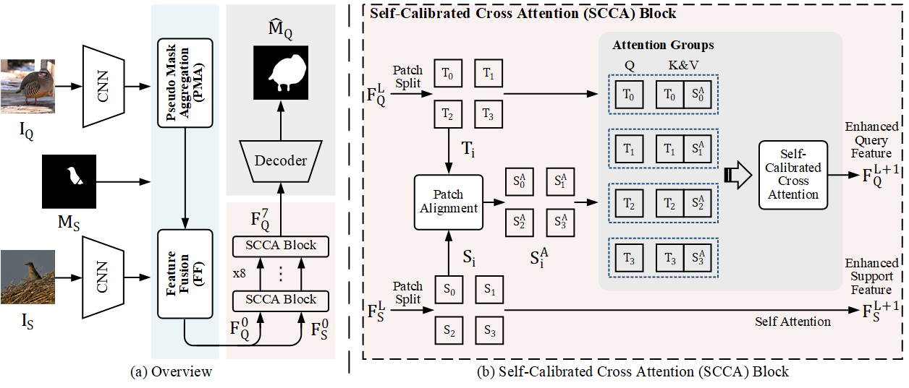
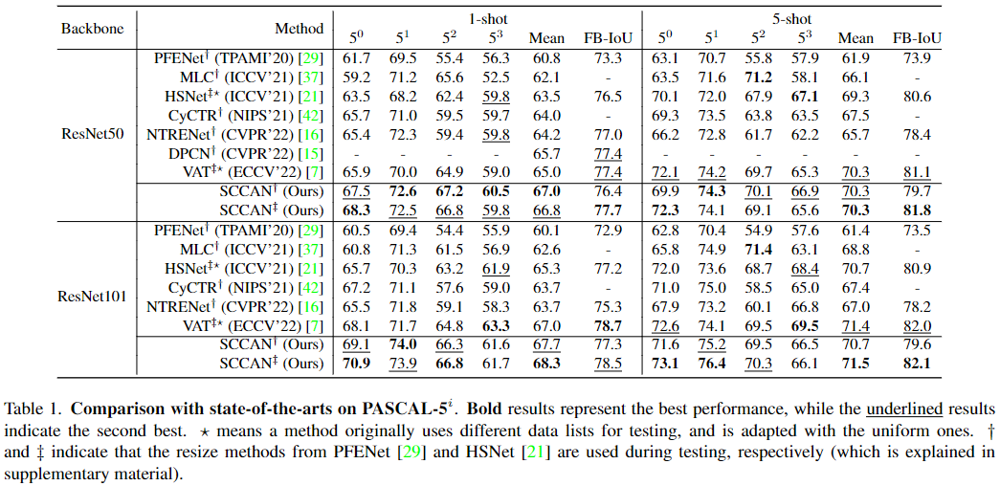
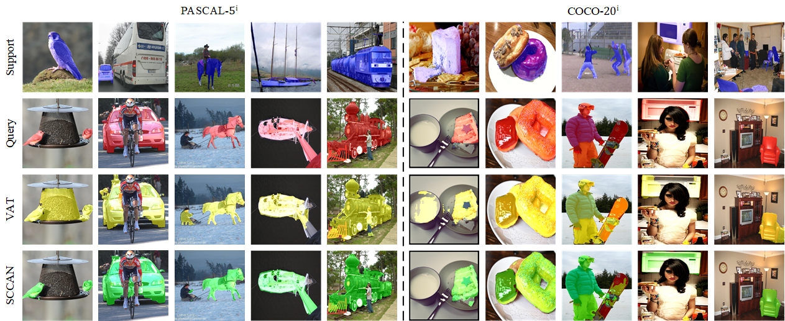

# Self-Calibrated Cross Attention Network for Few-Shot Segmentation

<p align="middle">
  
</p>

### Dependencies

- Python 3.8
- PyTorch 1.7.0
- cuda 11.0
- torchvision 0.8.0
```
> conda env create -f env_{ubuntu,windows}.yaml
```

### Datasets

- PASCAL-5<sup>i</sup>:  [VOC2012](http://host.robots.ox.ac.uk/pascal/VOC/voc2012/) + [SBD](http://home.bharathh.info/pubs/codes/SBD/download.html)
- COCO-20<sup>i</sup>:  [COCO2014](https://cocodataset.org/#download)

The directory structure is:

    ../
    ├── SCCAN/
    └── data/
        ├── VOCdevkit2012/
        │   └── VOC2012/
        │       ├── JPEGImages/
        │       ├── ...
        │       └── SegmentationClassAug/
        └── MSCOCO2014/           
            ├── annotations/
            │   ├── train2014/ 
            │   └── val2014/
            ├── train2014/
            └── val2014/

### Models

- Download the pre-trained backbones from [here](https://drive.google.com/file/d/1l1JG8AsxFAOUoY66YGK1lbXxutsVOcfg/view?usp=sharing) and put them into the `initmodel` directory.
- Download [exp.zip](https://drive.google.com/file/d/1e5cY6snOqlaQFJ5eW8Sg1AN-YnvJrE7h/view?usp=sharing) and compress it to obtain all pretrained models for PASCAL-5<sup>i</sup> and COCO-20<sup>i</sup>.

### Usage

- Change configuration via the `.yaml` files in `config`, then run the following commands for training and testing.

- **Meta-training**
  - *1-shot*
  ```
  CUDA_VISIBLE_DEVICES=0 python train_sccan.py --config=config/{pascal,coco}/{pascal,coco}_split{0,1,2,3}_resnet{50,101}.yaml
  ```
  - *5-shot*
  ```
  CUDA_VISIBLE_DEVICES=0,1,2,3 python train_sccan.py --config=config/{pascal,coco}/{pascal,coco}_split{0,1,2,3}_resnet{50,101}_5s.yaml
  ```

- **Meta-testing**
  - *1-shot*
  ```
  CUDA_VISIBLE_DEVICES=0 python test_sccan.py --config=config/{pascal,coco}/{pascal,coco}_split{0,1,2,3}_resnet{50,101}.yaml
  ```
  - *5-shot*
  ```
  CUDA_VISIBLE_DEVICES=0 python test_sccan.py --config=config/{pascal,coco}/{pascal,coco}_split{0,1,2,3}_resnet{50,101}_5s.yaml
  ```

### Performance

Performance comparison with the state-of-the-arts. 

1. ##### PASCAL-5<sup>i</sup>

<p align="middle">
  
</p>

2. ##### COCO-20<sup>i</sup>

<p align="middle">
  
</p>

### Visualization

<p align="middle">
    
</p>

### References

This repo is mainly built based on [BAM](https://github.com/chunbolang/BAM). Thanks for their great work!
